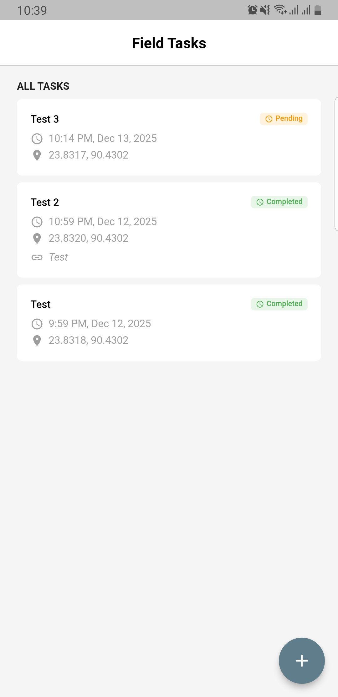
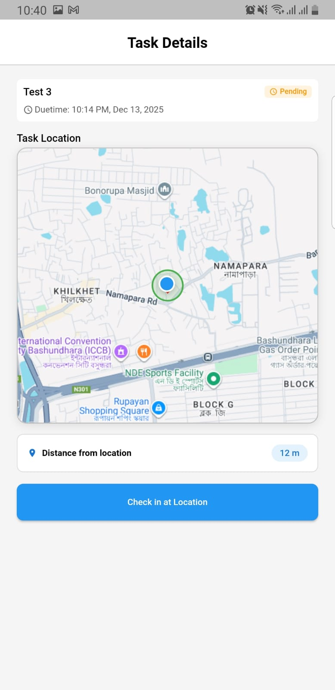
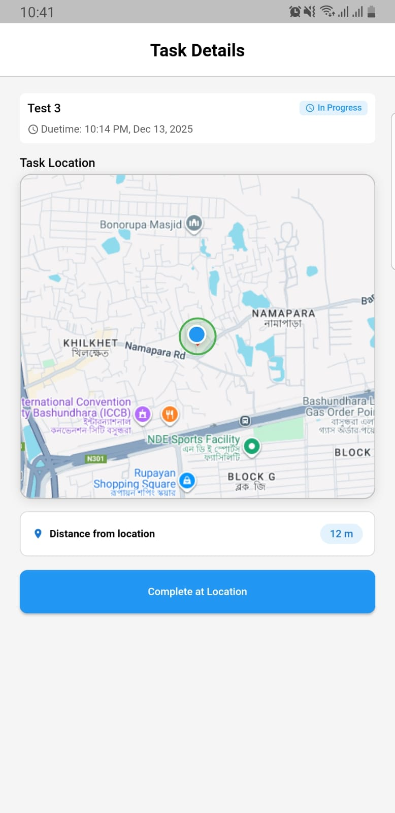
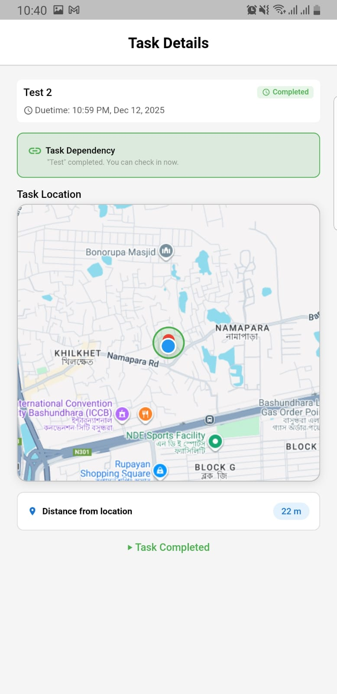
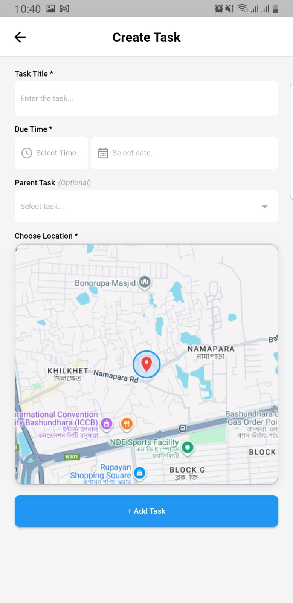

# Field Task – Location-Based Task Management App

A professional mobile application designed for on-field agents to manage inspections, deliveries, and maintenance visits in real-time. This app leverages GPS for location verification and robust offline support to ensure seamless productivity regardless of connectivity.

## 📱 App Overview & Screenshots

The Field Task app provides a clean, modern interface for managing daily assignments.

### 1. View & Manage Tasks
Agents can view a prioritized list of daily tasks with clear status indicators.


### 2. Task Details & Check-In
Comprehensive details view with map preview. Agents can only check in when physically near the location.
<p float="left">
  
   
  
</p>

### 3. Create New Tasks
Supervisors or agents can easily add new tasks, pinning exact locations on the map.


---

## 🚀 Key Features & User Flow

1.  **View Assigned Tasks**: Dashboard showing today's tasks with title, deadline, and status (Pending, Completed, Locked).
2.  **Create New Task**: Intuitive form to add tasks with title, due time, and map-based location selection.
3.  **Smart Location Check-In**:
    *   **Geofencing**: App verifies user is within **100 meters** of the task location.
    *   **Validation**: "Check-In" button is enabled only when proximity is confirmed.
4.  **Task Dependencies**: Enforces workflow rules—dependent tasks cannot be started until the parent task is marked complete.
5.  **Offline-First Architecture**:
    *   Full functionality without internet.
    *   Automatic background sync when connectivity is restored.

---

## 🛠 Project Architecture & Tech Stack

This project follows **Clean Architecture** principles to ensure scalability, testability, and separation of concerns.

### Architecture Layers
*   **Presentation Layer**: UI logic using **Flutter Bloc (Cubit)** for state management.
*   **Domain Layer**: Pure Dart business logic, Use Cases, and Entities.
*   **Data Layer**: Repositories, Data Sources (Local/Remote), and Models.

### Technology Stack
*   **Framework**: Flutter (Dart)
*   **State Management**: `flutter_bloc`
*   **Local Storage**: `hive` & `hive_flutter` (for offline persistence)
*   **Maps & Location**: `flutter_map`, `latlong2`, `geolocator`
*   **Dependency Injection**: `get_it` (implied standard practice)

---

## 📦 Deliverables & Setup

1.  **Source Code**: The complete source code is available in this repository.
2.  **APK File**: The generated Android APK file can be found here: [app-release.apk](dist/app-release.apk)

### How to Run
1.  **Clone the repository**:
    ```bash
    git clone <repository-url>
    ```
2.  **Install Dependencies**:
    ```bash
    flutter pub get
    ```
3.  **Run the App**:
    ```bash
    flutter run
    ```

---

> **Note**: This project demonstrates advanced Flutter patterns including offline sync, Clean Architecture, and location-based services.
